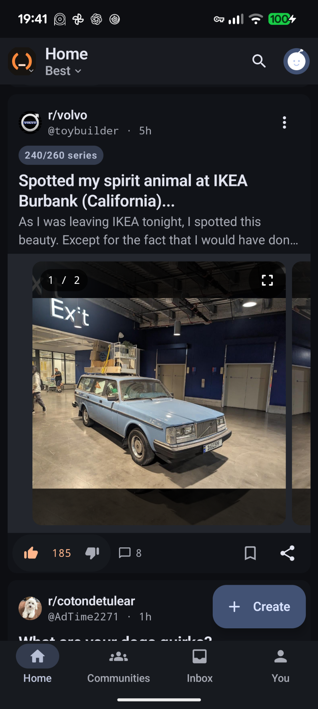
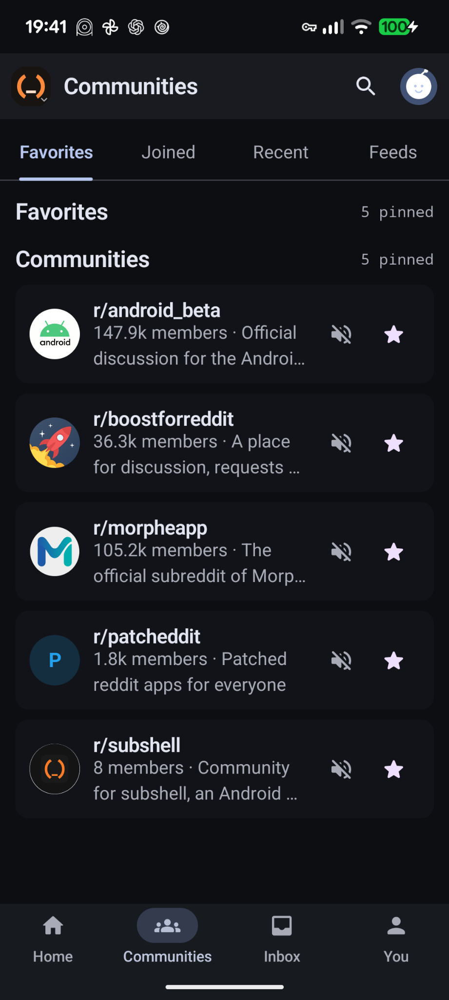
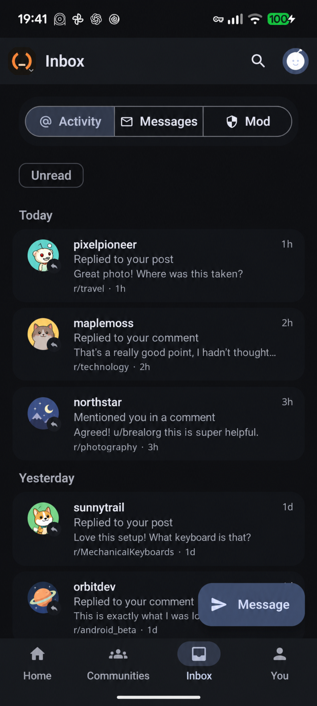

# subshell

**Public beta available — 0.77.0-beta.2**

**subshell** is an independent Android client for Reddit, built for
everyday Reddit use with a Material 3 interface.

**[Download the current public beta](https://github.com/brealorg/subshell/releases/tag/v0.77.0-beta.2)**

[Website](https://brealorg.github.io/subshell/) ·
[Releases](https://github.com/brealorg/subshell/releases) ·
[Report a bug](https://github.com/brealorg/subshell/issues/new?template=bug_report.yml) ·
[Request a feature](https://github.com/brealorg/subshell/issues/new?template=feature_request.yml) ·
[r/subshell](https://www.reddit.com/r/subshell/)

  
  
  

## Public beta

**0.77.0-beta.2** is the current public beta of subshell.

The beta is distributed as a signed Android APK through GitHub Releases.
The release includes a SHA-256 sidecar and a release provenance record so
the published artifact can be verified independently.

This is beta software. Bugs, rough edges, and behaviour changes are still
expected as testing expands beyond the development devices and accounts
used so far.

If you try it, bug reports and concrete UX feedback are particularly
useful.

## Feedback

- [Report a bug](https://github.com/brealorg/subshell/issues/new?template=bug_report.yml)
- [Request a feature](https://github.com/brealorg/subshell/issues/new?template=feature_request.yml)
- [Discuss subshell on r/subshell](https://www.reddit.com/r/subshell/)

When reporting a problem, include the subshell version, Android version,
device model when relevant, and clear reproduction steps.

Remove usernames, message contents, tokens, cookies, and other private
account information from screenshots and logs.

## Repository scope

This repository is the public project, release, documentation,
issue-tracking, and website home for subshell.

The Android application source code is **not published in this repository
at this stage**.

Public APKs are published only after passing the project's release
qualification and signing gates.

## Independence

subshell is independent software and is not affiliated with, endorsed by,
or sponsored by Reddit.
